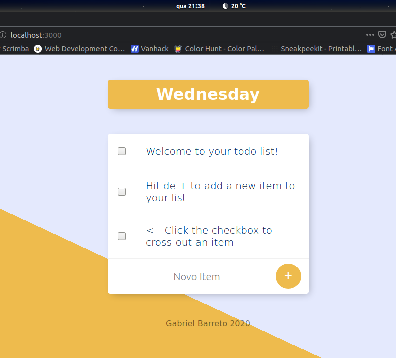
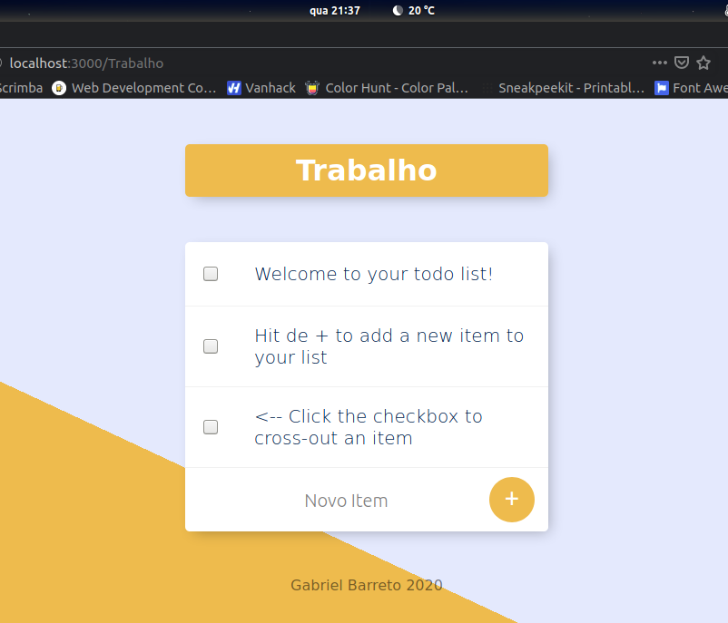

# Todo List

🇧🇷 PT-BR: Simples Todo list feita com o intuito de estudar mais sobre o ambiente Node.js e alguns de seus pacotes mais populares: Express, EJS e Mongoose. É possível criar diversas listas diferentes com persistência de dados (tarefas) digitando um nome qualquer na própria url i.e *endereço.com/nome_da_lista*. A lista na rota root tem o título de acordo com o dia da semana em inglês, a função que trata da data vem de um módulo local *date.js*. Toda a lógica reside no servidor (Express+Mongoose), e o frontend usa templates EJS e uma interface genérica retirada da internet.

🇺🇸 EN-US: Simple Todo list made in order to study more about the Node.js environment and some of its most popular packages: Express, EJS and Mongoose. You can create several different lists with data persistence (tasks) by typing any name in the url itself i.e. *address.com/list_name*. The list on the root route is titled according to the day of the week in English, the function that handles the date comes from a local *date.js* module. All the logic resides on the server (Express+Mongoose), and the frontend uses EJS templates and a generic interface taken from the internet.

